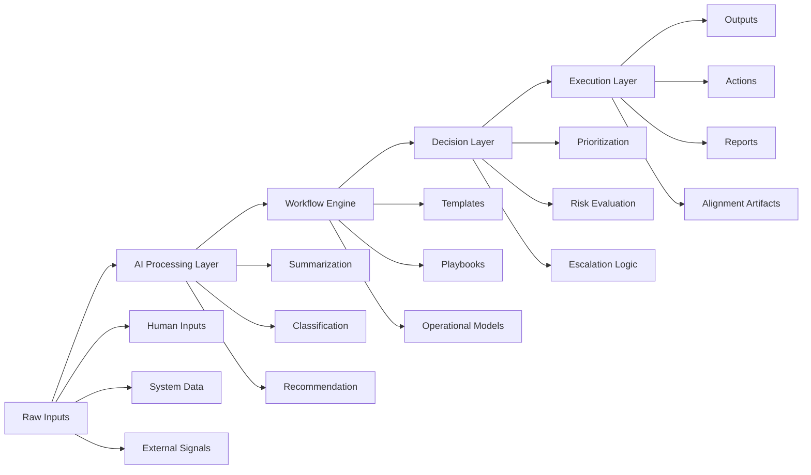

# AI‑Ops Data Flow

This diagram shows how information moves through the AI‑Ops Framework.

```mermaid
flowchart LR
    A[Raw Inputs] --> B[AI Processing Layer]
    B --> C[Workflow Engine]
    C --> D[Decision Layer]
    D --> E[Execution Layer]
    E --> F[Outputs]

    A --> A1[Human Inputs]
    A --> A2[System Data]
    A --> A3[External Signals]

    B --> B1[Summarization]
    B --> B2[Classification]
    B --> B3[Recommendation]

    C --> C1[Templates]
    C --> C2[Playbooks]
    C --> C3[Operational Models]

    D --> D1[Prioritization]
    D --> D2[Risk Evaluation]
    D --> D3[Escalation Logic]

    E --> E1[Actions]
    E --> E2[Reports]
    E --> E3[Alignment Artifacts]
```
