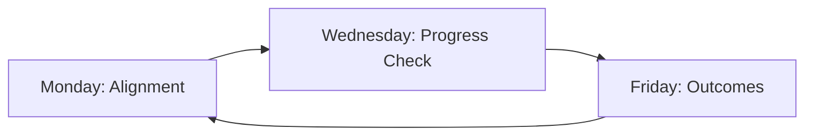
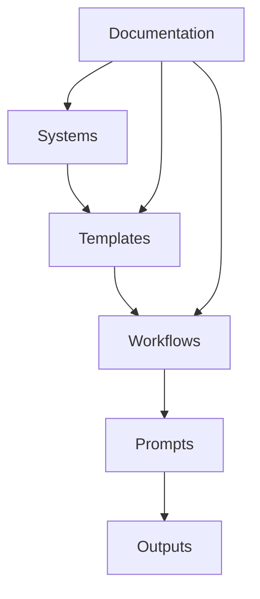
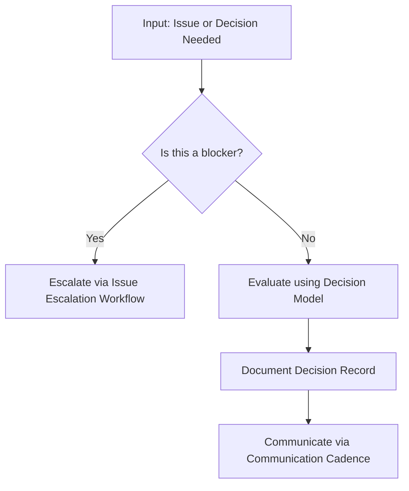
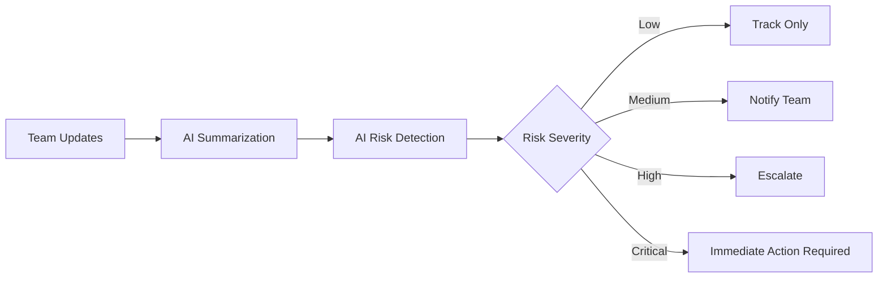
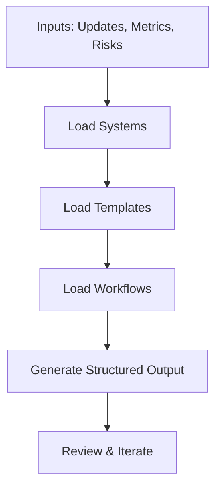
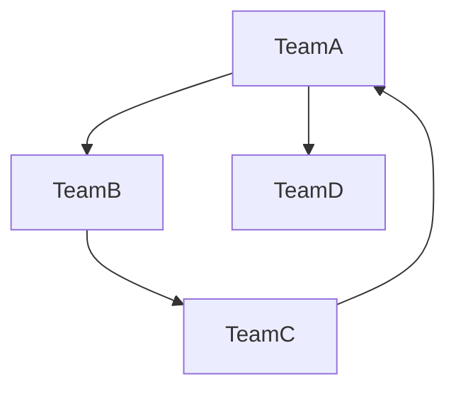
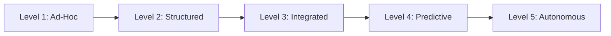

# Expanded Diagrams

A collection of diagram definitions and visual models that represent the structure, logic, and workflows of the AI‑Ops Framework.  
These diagrams are written in Markdown‑friendly formats (e.g., Mermaid) so they can be rendered visually in the future.

---

## 1. Workflow: Weekly Operating Rhythm (Mermaid)

---

## 2. System Interaction Model

---

## 3. Decision‑Making Flow

---

## 4. Risk Detection Loop

---

## 5. AI‑Assisted Output Generation

---

## 6. Cross‑Team Dependency Map (Conceptual)

---

## 7. Maturity Model Progression

---

## 8. Future Diagram Slots

Reserved for upcoming visuals such as:

- Workflow swimlanes  
- Sequence diagrams  
- Cross‑team alignment maps  
- AI‑assisted decision trees  
- Governance flow diagrams  
- Metrics dashboards  

Add new diagrams here as they are created.

---

## 9. Purpose of This File

This file serves as:

- A central home for all diagram definitions  
- A future‑ready visual layer for the framework  
- A reference for contributors and AI agents  
- A foundation for future rendering into images or a documentation website  
