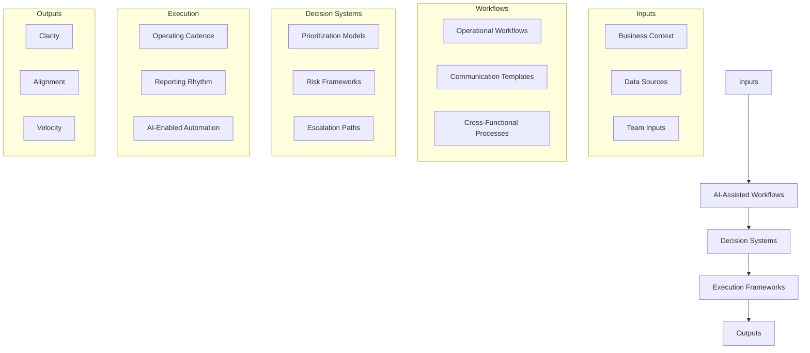

# AI‑Ops System Overview

This diagram illustrates the high‑level structure of the AI‑Ops Framework.

```mermaid
flowchart TD
    A[Inputs] --> B[AI‑Assisted Workflows]
    B --> C[Decision Systems]
    C --> D[Execution Frameworks]
    D --> E[Outputs]

    subgraph Inputs
        A1[Business Context]
        A2[Data Sources]
        A3[Team Inputs]
    end

    subgraph Workflows
        B1[Operational Workflows]
        B2[Communication Templates]
        B3[Cross‑Functional Processes]
    end

    subgraph Decision Systems
        C1[Prioritization Models]
        C2[Risk Frameworks]
        C3[Escalation Paths]
    end

    subgraph Execution
        D1[Operating Cadence]
        D2[Reporting Rhythm]
        D3[AI‑Enabled Automation]
    end

    subgraph Outputs
        E1[Clarity]
        E2[Alignment]
        E3[Velocity]
    end
```
