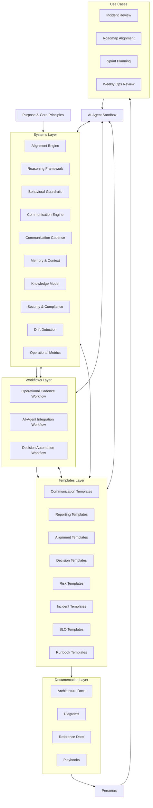

# Visual Index

A centralized index of all diagrams, architecture visuals, conceptual maps, and structural references within the AI‑Ops Framework.

This page provides a visual entry point into the system for new users, contributors, and AI agents.

---

## 1. Architecture & Structure

### Architecture Deep Dive
File: 'ai-ops-architecture-deep-dive.md'
**Description:**
Explains the full architectural model of the framework, including layers, data flow, and AI consumption patterns.

---

## 2. Dependency Mapping

### Dependency Map  
**File:** `dependency-map.md`  
**Description:**  
Shows how workflows, templates, systems, prompts, and documentation depend on and interact with each other.

---

## 3. Operating Model

### End‑to‑End Operating Playbook  
**File:** `operating-playbook.md`  
**Description:**  
Visualizes the weekly operating rhythm, workflows, templates, and AI‑assisted execution flow.

---

## 4. Maturity Progression

### AI‑Ops Maturity Model  
**File:** `ai-ops-maturity-model.md`  
**Description:**  
Defines the five levels of AI‑Ops maturity and the progression path from Ad‑Hoc to Autonomous Operations.

---

## 5. Metrics & Governance

### Operational Metrics Framework  
**File:** `../systems/system-operational-metrics.md`  
**Description:**  
Outlines the measurement model for clarity, velocity, alignment, risk exposure, and execution reliability.

### Security & Compliance Model  
**File:** `../systems/system-security-compliance.md`  
**Description:**  
Defines data handling rules, access control patterns, and AI‑assisted compliance checks.

---

## 6. System Overview

### Module Registry  
**File:** `../MODULE_REGISTRY.md`  
**Description:**  
A complete index of all workflows, templates, systems, prompts, and documentation.

---

## 7. Conceptual Visuals (Future Expansion)

This section is reserved for future diagrams such as:

- Workflow swimlanes  
- Decision trees  
- Sequence diagrams  
- Cross‑team dependency maps  
- AI‑assisted decision flows  

Add new visuals here as they are created.

---

## 8. How to Use This Index

Use this page when you want to:

- Understand the system visually  
- Navigate diagrams quickly  
- Onboard new contributors  
- Provide AI agents with visual context  
- Explore the architecture without reading every file  

This index serves as the visual entry point into the entire AI‑Ops Framework.

---

# 📊 AI‑Ops Framework Architecture Map

